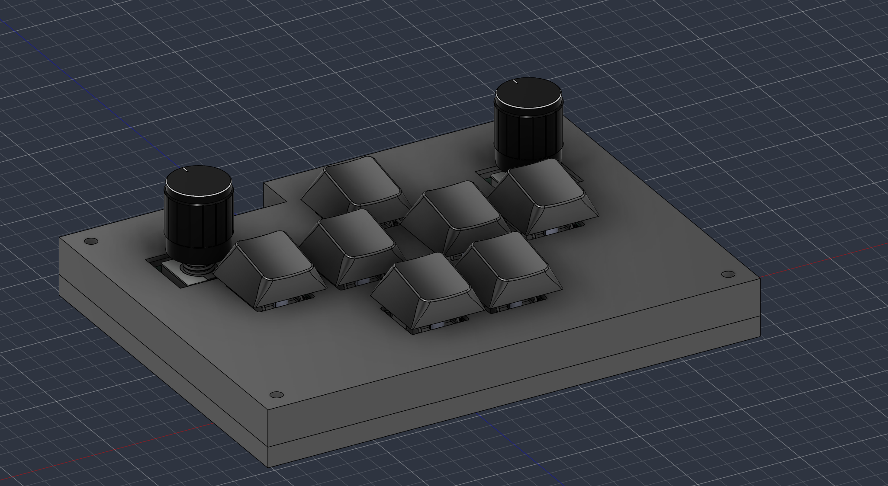
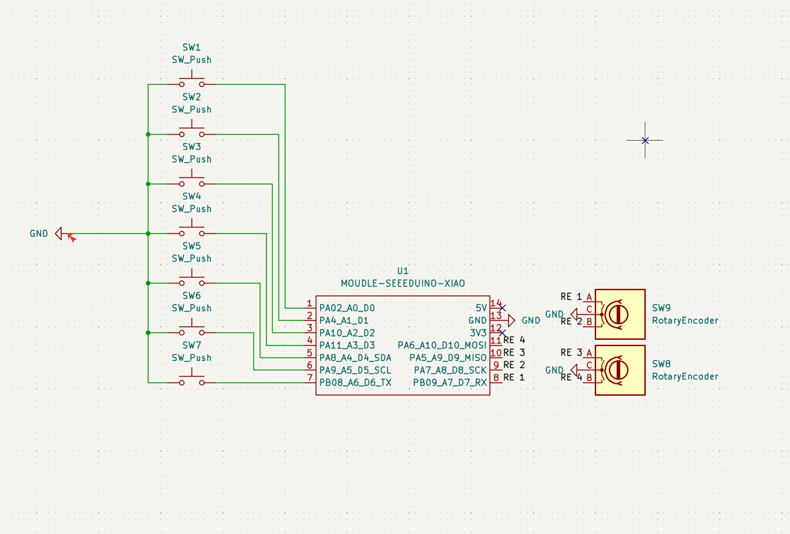
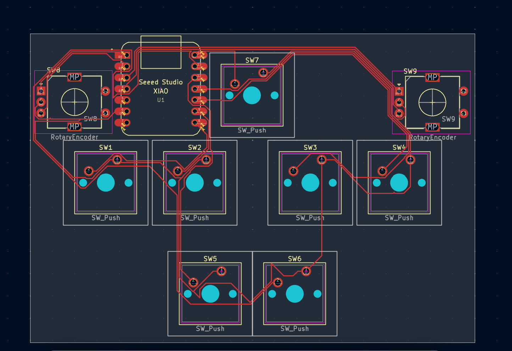
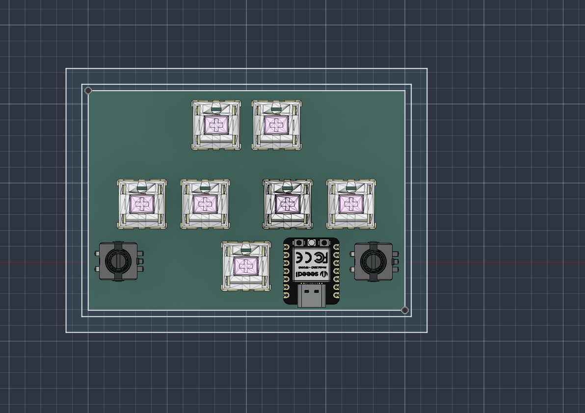
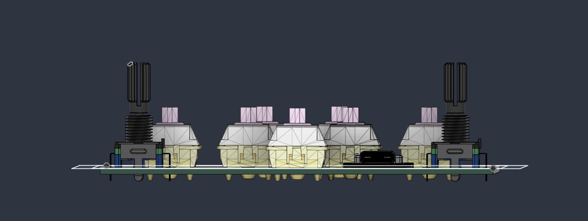
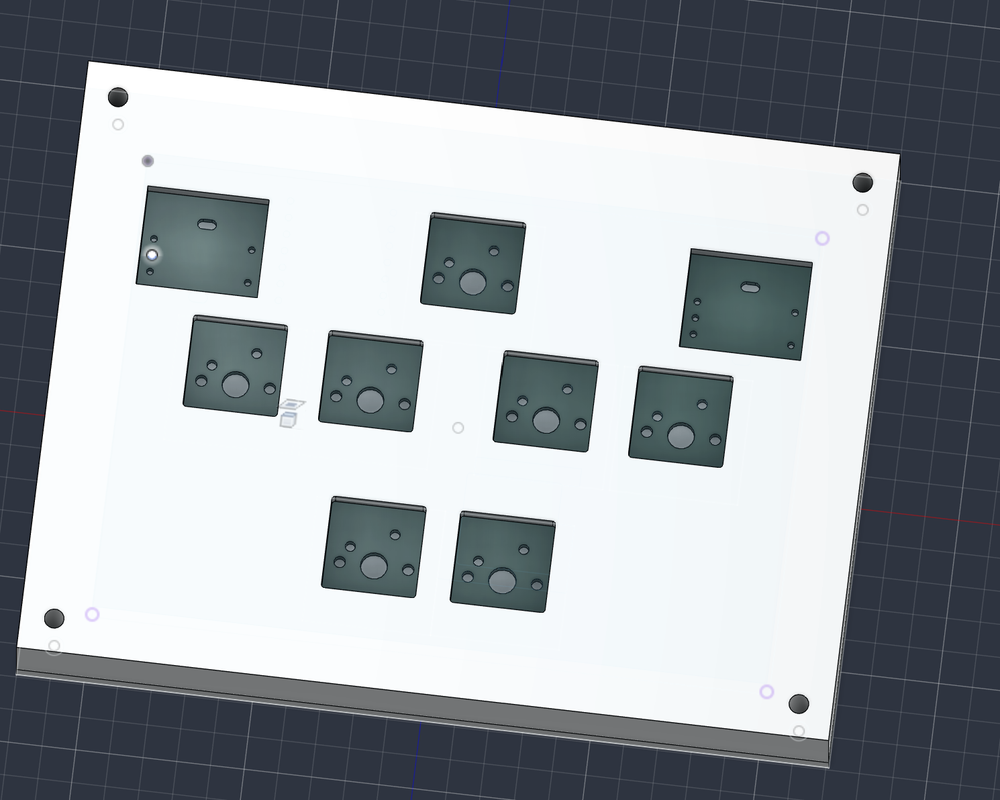
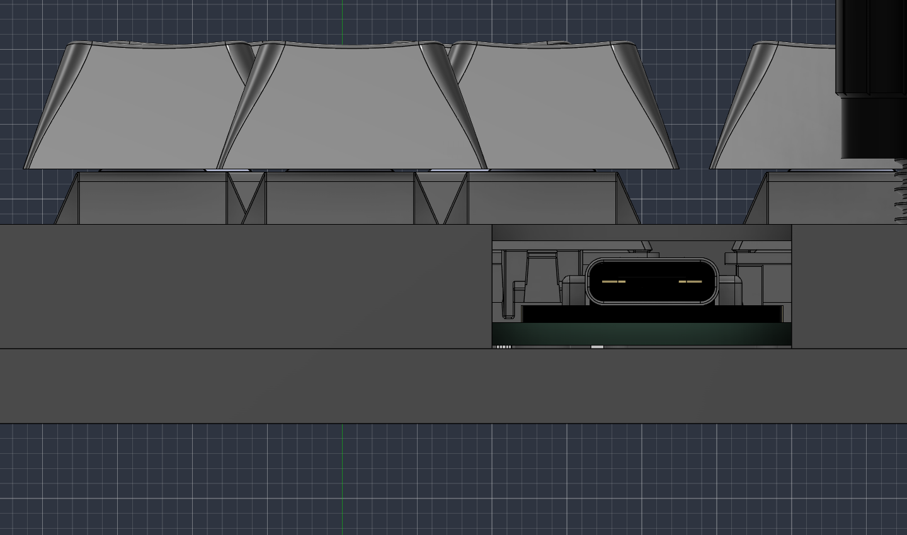
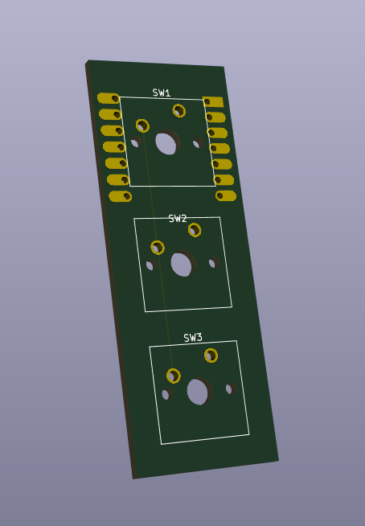
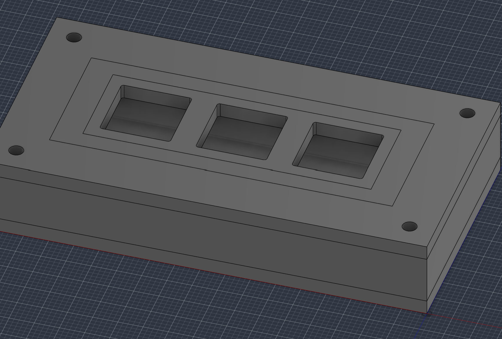

# Sound Voltex Macro Pad

A low-cost, open-source **Sound Voltex-style (SDVX) rhythm game controller** built around the Seeed XIAO RP2040. It has 7 buttons and 2 rotary encoders on a custom PCB designed in KiCad, with a 3D-modeled enclosure designed in Autodesk Fusion 360.

Built for **[Hack Club](https://hackclub.com) Stardance**.

## Why I'm building this

Commercial SDVX-style controllers can be expensive. The goal of this project is a cheaper, more accessible controller that anyone in the community can build, modify, and learn from.

## Features

- **7 MX-style mechanical switches** in an SDVX-inspired layout
- **2 rotary encoders** for the knobs
- **Seeed XIAO RP2040** microcontroller with a USB-C connection
- **Custom PCB** with schematic and board layout designed in KiCad
- **3D-printable enclosure** modeled in Fusion 360, with a USB-C cutout and corner mounting holes
- **Firmware:** QMK (in progress)

## Hardware

| Qty | Part |
|----:|------|
| 1 | Seeed XIAO RP2040 |
| 7 | MX-style mechanical switches |
| 2 | Rotary encoders |
| 7 | Keycaps |
| 2 | Knobs |
| 1 | Custom PCB (KiCad files in this repo) |
| 1 | 3D-printed enclosure |

## Pin mapping

| Input | XIAO pin |
|-------|----------|
| SW1 | D0 |
| SW2 | D1 |
| SW3 | D2 |
| SW4 | D3 |
| SW5 | D4 |
| SW6 | D5 |
| SW7 | D6 |
| Encoder 1 (A / B) | D7 / D8 |
| Encoder 2 (A / B) | D9 / D10 |

All switches share a common ground. Each one is wired directly to its own GPIO pin.

## Design

### Schematic

### PCB layout

Routed board in KiCad:

3D views of the board with components:

### Enclosure

The enclosure is modeled around the board so that the XIAO's USB-C port lines up with a cutout in the side wall.

### Early prototype

The first version was a 3-key test board used to check footprints and case fit before moving to the full layout.

## Status

- [x] Schematic
- [x] PCB layout and routing
- [x] 3D enclosure model
- [ ] Firmware (QMK), in progress
- [ ] Order PCB and assemble
- [ ] Print enclosure and test

## Tools

- **KiCad:** schematic capture and PCB design
- **Autodesk Fusion 360:** enclosure and 3D modeling
- **QMK** (via QMK MSYS): firmware
- **Lychee Slicer:** preparing the enclosure for resin 3D printing

## About

Designed by **Milo Sa**, a first-year Computer Engineering student at Washington State University.
